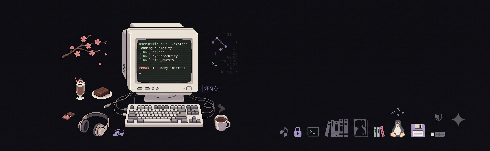

<div align="center">



<br>

# `CURIOUS_OS`

### `explore → build → break → understand`

`software engineer` · `curious by default` · `occasionally lost in a rabbit hole`

<br>

[](https://github.com/saralaufeyson)
[](https://github.com/saralaufeyson)

</div>

---

## `boot sequence`

```text
user@curious:~$ whoami

software engineer
builder of things
professional rabbit-hole explorer

user@curious:~$ ./personality

explore → build → break → learn
        ↳ repeat

user@curious:~$ cat error.log

[WARN] too many interests detected
[WARN] unfinished projects detected
[ OK ] curiosity still operational

user@curious:~$
```

I don't really have one lane.

I like unfamiliar problems, weird little experiments, understanding how systems work,
and then building something with whatever I learned.

Some days that means writing software.
Some days it's automation or infrastructure.
Some days it's cybersecurity.
And sometimes it's a completely unnecessary side project that begins with:

> **"wait... can I actually do that?"**

---

## `~/status`

<table>
<tr>
<td width="50%" valign="top">

### `CURRENTLY`

```text
┌──────────────────────────────┐
│                              │
│  learning                    │
│  ├─ DevOps                   │
│  └─ Cybersecurity            │
│                              │
│  exploring                  │
│  └─ Red Teaming              │
│                              │
│  building                    │
│  └─ whatever looks fun       │
│                              │
│  status                      │
│  └─ exploring...             │
│                              │
└──────────────────────────────┘
```

</td>
<td width="50%" valign="top">

### `SYSTEM METRICS`

```text
curiosity         ████████████████████  ∞%
unfinished ideas  ████████████████████  ∞%
sleep             ██████░░░░░░░░░░░░░░  31%
tabs open         ████████████████████  ????
```

```text
uptime:    questionable
motivation: online
focus:     depends on the rabbit hole
```

</td>
</tr>
</table>

---

## `~/toolbox`

I collect tools rather than trying to collect a perfect tech stack.

<table>
<tr>
<td valign="top" width="33%">

**LANGUAGES**

`C++` · `C#`  
`Java` · `JavaScript`  
`TypeScript` · `Python`

</td>
<td valign="top" width="33%">

**WEB & BACKEND**

`React` · `Angular`  
`Node.js` · `Express`  
`Django` · `Flask`  
`HTML` · `CSS`

</td>
<td valign="top" width="33%">

**DATA & SYSTEMS**

`MongoDB` · `MySQL`  
`SQLite` · `Pandas`  
`Docker` · `Linux`  
`Azure` · `Streamlit`

</td>
</tr>
<tr>
<td valign="top">

**BUILD & DEBUG**

`Git` · `Postman`  
`REST APIs` · `MERN`

</td>
<td valign="top">

**DESIGN**

`Figma` · `UI/UX`

</td>
<td valign="top">

**ALSO EXPERIMENTED WITH**

`Unity` · `Arduino`  
`MATLAB` · `Generative AI`

</td>
</tr>
</table>

> `tools change. curiosity doesn't.`

---

## `~/projects`

### `01` — `ARTOPUS INDIA`

**`MERN` · `E-COMMERCE` · `ART`**

A platform built around discovering, buying and selling art — because apparently
building an art marketplace wasn't enough, so I decided to build one.

**status:** `shipping` · `very proud of this one`

[ `live site` ](https://www.artopusindia.com) · [ `source code` ](https://github.com/saralaufeyson/Artopus-Ecom)

---

### `02` — `ART DESCRIPTOR`

**`PYTHON` · `GEN AI` · `OPENAI`**

Upload an artwork → let AI interpret it → generate an art description → turn it into a PDF.

A tiny experiment somewhere between art, automation and "what if I made this?"

**status:** `sleeping peacefully` · `API key has entered the void`

[ `source code` ](https://github.com/saralaufeyson/Artdescriptor)

---

### `03` — `THE NEXT EXPERIMENT`

```text
┌─────────────────────────────────────────────┐
│                                             │
│  idea found                                 │
│      ↓                                      │
│  rabbit hole entered                        │
│      ↓                                      │
│  "this should be easy"                      │
│      ↓                                      │
│  it was not easy                            │
│      ↓                                      │
│  learned approximately 47 new things        │
│      ↓                                      │
│  somehow became a project                   │
│                                             │
└─────────────────────────────────────────────┘
```

`coming soon... probably`

---

## `~/side_quests`

These are not career pivots.

They're just things I got curious about and refused to leave alone.

```text
CYBERSECURITY     ████████████░░░░  exploring
DEVOPS            █████████████░░░  exploring
WEB               ████████████████  building
AUTOMATION        █████████████░░░  building
DESIGN            ███████████░░░░░  creating
RANDOM CURIOSITY  ████████████████  dangerous
```

There is no roadmap.

There are only **side quests**.

---

## `~/currently_reading`

```text
┌──────────────────────────────────────────────┐
│                                              │
│  CURRENT RABBIT HOLES                        │
│                                              │
│  → cybersecurity                             │
│  → red teaming                               │
│  → systems & infrastructure                  │
│  → understanding things I probably shouldn't │
│                                              │
│  NEXT QUESTION:                              │
│  "okay but how does it actually work?"       │
│                                              │
└──────────────────────────────────────────────┘
```

---

## `~/comfort_media`

```text
$ cat comfort_media.txt

Bungo Stray Dogs
Frieren
The Apothecary Diaries

────────────────────────────────

looking for:
    underrated anime
    interesting rabbit holes
    oddly specific facts
    things that make me go "ohhhhhh"
```

---

## `~/fuel`

```text
$ cat fuel.txt

brownies          ████████████████████
chocolate         ███████████████████░
chocolate shake   ████████████████████
alfredo pasta     ██████████████████░░

fuel efficiency: questionable
productivity: somehow operational
```

---

## `~/github`

<div align="center">


<br><br>


</div>

---

## `~/connect`

<div align="center">

[](https://www.linkedin.com/in/layasree-k)
[](https://www.instagram.com/voice_of_laya)
[](https://www.dribbble.com/LazyShika)
[](https://www.behance.net/SaraLaufeyson)
[](https://leetcode.com/u/lazyShika/)

</div>

---

<div align="center">

```text
╭────────────────────────────────────────────────────────╮
│                                                        │
│   user@curious:~$ ./shutdown                          │
│                                                        │
│   ERROR: curiosity process still running               │
│                                                        │
│   attempting to terminate...                           │
│   failed.                                               │
│                                                        │
│   user@curious:~$                                      │
│   █                                                    │
│                                                        │
╰────────────────────────────────────────────────────────╯
```

### `keep exploring. keep building. keep asking why.`

`maintained by sara • somewhere between curiosity and chaos`

</div>
